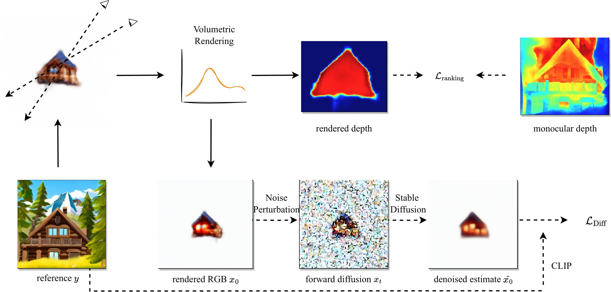

# NeuralLift-360: Lifting An In-the-wild 2D Photo to A 3D Object with 360° Views

[[Paper]](https://arxiv.org/abs/2211.16431) [[Website]](https://vita-group.github.io/NeuralLift-360/)

## News

- **23.03.12 Basic workflow is released! [Gradio App](#gradio) released!** 

We're working on rolling out new exciting features soon and will prepare tutorials and better interface using gradio. Stay tuned!

## Pipeline



## Environment

`pip install -r requirements.txt` will do the job.

`pip install gradio` if you want to run the [Gradio App](#gradio).

## Data Preparation

In our experiments, we use the depth from [Boost Your Own depth](https://github.com/compphoto/BoostingMonocularDepth) together with [LeRes](https://github.com/aim-uofa/AdelaiDepth/tree/main/LeReS).

The colab notebook to export depth in numpy can be found [here](https://colab.research.google.com/drive/15YCsqaO6l94HueVwPQgHqVVDUJzdOEO5?usp=sharing).

The foreground mask can be obtained using this repo: https://github.com/Ir1d/image-background-remove-tool


## Gradio

```bash
python gradio_app.py
# add `--share` if you want an external public link
```

We prepare a Gradio App as well!

Note: Currently, we load config from a pre-defined yaml file and we'll update this later. Also, it's a bit slower compared to directly running the training script because we have to render during training.

## Training

We prepare the config files in the yaml file in `configs` directory.

```bash
python main.py --config configs/cabin.yaml
```

### Text inversion [Optional]

The following script runs text inversion to obtain a better text embedding.

```bash
export MODEL_NAME="runwayml/stable-diffusion-v1-5"
accelerate launch text_inversion.py \
  --pretrained_model_name_or_path=$MODEL_NAME \
  --learnable_property="object" \
  --placeholder_token="<cabin>" --initializer_token="cabin" \
  --resolution=512 \
  --train_batch_size=1 \
  --gradient_accumulation_steps=4 \
  --max_train_steps=1000 \
  --learning_rate=5.0e-04 --scale_lr \
  --lr_scheduler="constant" \
  --lr_warmup_steps=0 \
  --output_dir="cabin_ti" \
  --im_path='data/cabin4_centered.png' \
  --mask_path='data/cabin4_centered_mask.png'
```

`test_dm.py` can be used to validate the effectiveness of textual inversion.

An example config is provided in `configs/cabin_ti.yaml`

The corresponding training script is:

```bash
python main.py --config configs/cabin_ti.yaml
```

### Imagic Finetuning [Optional]

Coming soon.

## Testing

After training process finishes, the code will automatically generates a video named `lift_ep0100_rgb.mp4`

You can filter out all these videos in the log folder and sort them by time using the following code.

```bash
find ./ -name lift_ep0100_rgb.mp4 -printf "%T@ %Tc %p\n" | sort -n  
```

If you want to run test only, go to the yaml config file, change `test: False` to `test: True` and `ckpt: ` to the path of the trained checkpoint.


## Acknowledgement

Codebase based on https://github.com/ashawkey/stable-dreamfusion . Thanks [Jiaxiang Tang](https://me.kiui.moe/) for sharing and the insightful discussions!

## Citation

If you find this repo is helpful, please cite:

```

@InProceedings{Xu_2022_neuralLift,
author = {Xu, Dejia and Jiang, Yifan and Wang, Peihao and Fan, Zhiwen and Wang, Yi and Wang, Zhangyang},
title = {NeuralLift-360: Lifting An In-the-wild 2D Photo to A 3D Object with 360° Views},
journal={arXiv preprint arXiv:2211.16431},
year={2022}
}

```


